# Getting started tutorial

## Learning objectives

By the time you finish the tutorial, you will understand how to:

- Define entities
- Plan a dialog
- Use node and response conditions in a dialog

## Duration
This tutorial will take approximately 2 to 3 hours to complete.

## Create the Watson Conversation Service instance

1.  Go to the Watson Developer Console  page.
1.  Select **Conversation**, click **Add Services**, and either sign up for a free **IBM Cloud Lite** account or log in if you have an existing account.
1.  Type `conversation-tutorial` as the project name and click **Create Project**.

## Step 1: Launch the tool

After you create a project that includes the Conversation service, you'll land on the project details page. Launch the  Conversation tool from here.

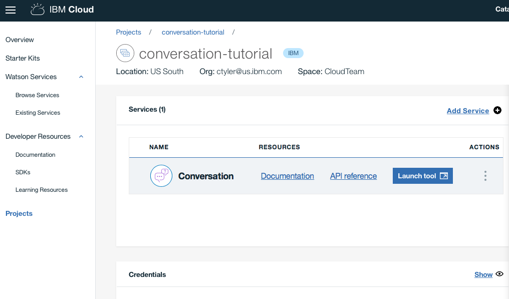

Click **Launch Tool** for Conversation under **Services**.

If you're prompted to log into the tool, provide your **IBM Cloud** credentials.

If you're not at a project details page for the Conversation service, go to the Watson Developer Console  page and select the project.

## Step 2: Create a workspace

Your first step in the Conversation tool is to create a workspace.

A **workspace** is a container for the artifacts that define the conversation flow.

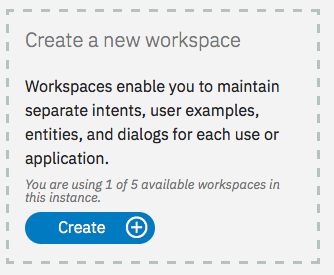

1.  In the Conversation tool, click **Create**.
1.  Give your workspace the name `Conversation tutorial`. If the dialog you plan to build will use a language other than English, then choose the appropriate language from the list. Click **Create**. Youʼll land on the **Intents** tab of your new workspace.

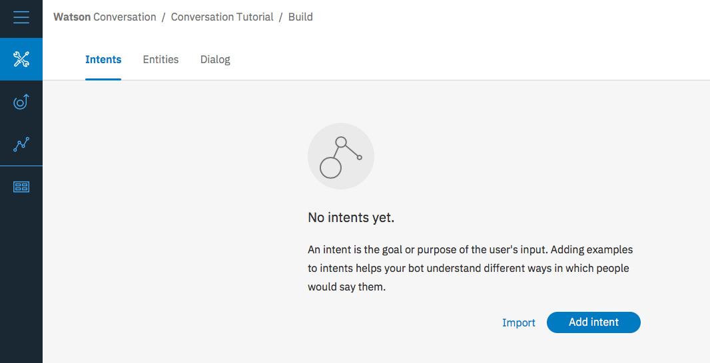

## Step 3: Create intents
An **intent** represents the purpose of a user's input. You can think of intents as the actions your users might want to perform with your application.

For this example, we're going to keep things simple and define only two intents: one for saying hello, and one for saying goodbye.

1.  Make sure you're on the Intents tab. (You should already be there, if you just created the workspace.)
1.  Click **Add intent**.
1.  Name the intent `hello`, and then click **Create intent**.
1.  Type `hello` into the **Add user example** field, and then press **Enter**.

   *Examples* tell the Conversation service what kinds of user input you want to match to the intent. The more examples you provide, the more accurate the service can be at recognizing user intents.
1.  Add four more examples:
    - `good morning`
    - `greetings`
    - `hi`
    - `howdy`

1.  Click the **Close**  icon to finish creating the #hello intent.
1.  Create another intent named #goodbye with these five examples:
    - `bye`
    - `farewell`
    - `goodbye`
    - `I'm done`
    - `see you later`

You've created two intents, #hello and #goodbye, and provided example user input to train Watson to recognize these intents in your users' input.

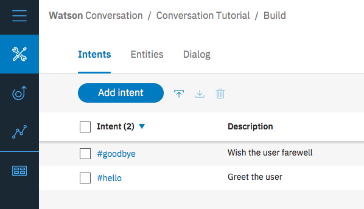

## Step 4: Build a dialog

A **dialog** defines the flow of your conversation in the form of a logic tree. Each node of the tree has a condition that triggers it, based on user input.

We'll create a simple dialog that handles our #hello and #goodbye intents, each with a single node.

### Adding a start node

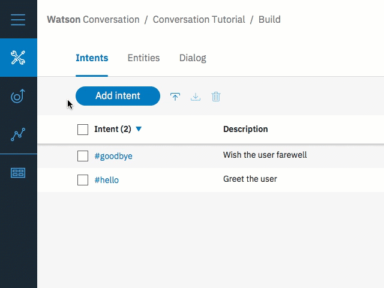

1.  In the Conversation tool, click the **Dialog** tab.
1.  Click **Create**. You'll see two nodes:
    - **Welcome**: Contains a greeting that is displayed to your users when they first engage with the bot.
    - **Anything else**: Contains phrases that are used to reply to users when their input is not recognized.
	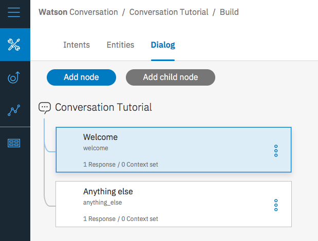
	
1.  Click the **Welcome** node to open it in the edit view.
1.  Replace the default response with the text, `Welcome to the Conversation tutorial!`.

    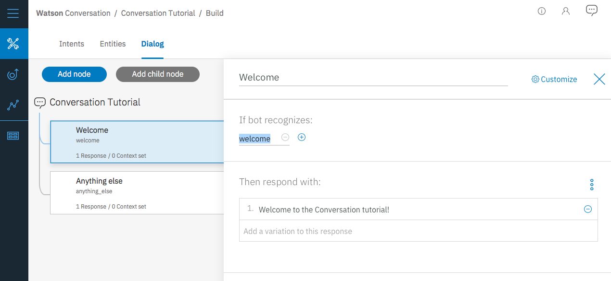
1.  Click  to close the edit view.

You created a dialog node that is triggered by the `welcome` condition, which is a special condition that indicates that the user has started a new conversation. Your node specifies that when a new conversation starts, the system should respond with the welcome message.

### Testing the start node

You can test your dialog at any time to verify the dialog. Let's test it now.

- Click the  icon to open the *Try it out* pane. You should see your welcome message.
  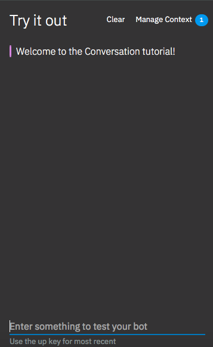
- Click  to close the *Try it out* view.

### Adding nodes to handle intents

Now let's add nodes to handle our intents between the `Welcome` node and the `Anything else` node.

1.  Click the More icon  on the **Welcome** node, and then select **Add node below**.
1.  Give the node a name and type `#hello` in the **Enter a condition** field of this node. Then select the **#hello** option.
1.  Add the response, `Good day to you.`
1.  Click  to close the edit view.
1.  Click the More icon  on this node, and then select **Add node below** to create a peer node. In the peer node, specify `#goodbye` as the condition, and `OK. See you later!` as the response.
1.  Click  to close the edit view.

    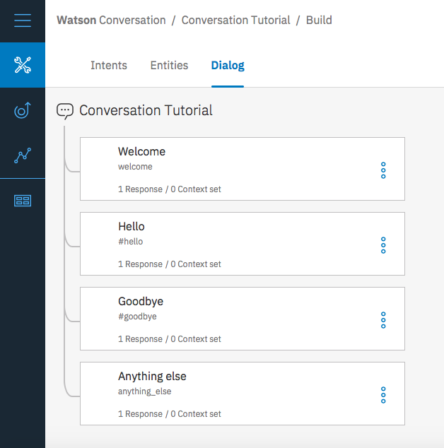

### Testing intent recognition

You  built a simple dialog to recognize and respond to both hello and goodbye inputs. Let's see how well it works.

1.  Click the  icon to open the *Try it out* pane. There's that reassuring welcome message.
1.  At the bottom of the pane, type `Hello` and press Enter. The output indicates that the #hello intent was recognized, and the appropriate response (`Good day to you.`) appears.
1.  Try the following input:
    - `bye`
    - `howdy`
    - `see ya`
    - `good morning`
    - `sayonara`

Watson can recognize your intents even when your input doesn't exactly match the examples you included. The dialog uses intents to identify the purpose of the user's input regardless of the precise wording used, and then responds in the way you specify.

## Step 5: Add more advanced intents and examples

1.  Go back to the Intents page and click **Add intent**.
1.  Add the following intent name, and then click **Create intent**. Create the intent `#turn_on`. The `#turn_on` intent indicates that the user wants to turn on an appliance such as the radio, windshield wipers, or headlights.
1.  In the **Add user example** field, type the following utterance, and then click **Add example**. Enter the following examples:
    - I need
    - Play
    - Play some
    - Start
    - turn on
    - Crank up
1.  Click the **Close**  icon to finish adding the `#turn_on` intent.

You now have three intents, the `#turn_on` intent that you just added, and the `#hello` and `#goodbye`. Each intent has a set of example utterances that help train Watson to recognize the intents in user input.

## Step 6: Add entities

An **entity** definition includes a set of entity *values* that can be used to trigger different responses. Each entity value can have multiple *synonyms*, which define different ways that the same value might be specified in user input.

Create entities that might occur in user input that has the #turn_on intent to represent what the user wants to turn on.

1.  Click the **Entities** tab to open the Entities page.
1.  Click **Add entity**.
1.  Add the `@appliance` entity name, and then press Enter. The `@appliance` entity represents an appliance in the car that a user might want to turn on.
1.  Add the following entities:

    | Entity value |  Type   | Values                              |
    |--------------|---------|-------------------------------------|
    | radio        | Synonym | music, tunes, songs                 |
    | ac           | Synonym | air, air conditioner                |
    | heater       | Synonym | heat                                |
    | headlights   | Synonym | lights, headlamps                   |

1.  Click the toggle to turn fuzzy matching **On** for the `@appliance` entity.
    This setting helps the service recognize references to entities in user input even when the entity is specified in a way that does not exactly match the syntax you use here.
1.  Click the **Close**  icon to finish adding the `@appliance` entity.

    It should look like this:

    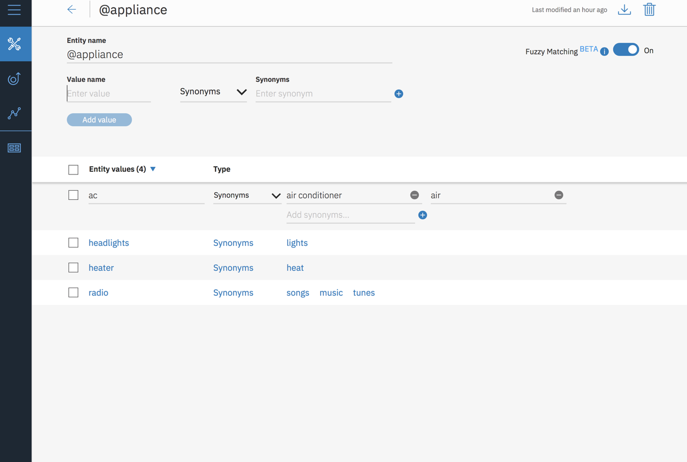

1.  Repeat Steps 2-6 to create the `@genre` entity with fuzzy matching on, and these values and synonyms:

    | Entity value |  Type   | Values                                |
    |--------------|---------|---------------------------------------|
    | classical    | Synonym | symphonic                             |
    | jazz         | Synonym |                                       |
    | pop          | Synonym | top 40                                |
    | rock         | Synonym | rock & roll, rock and roll, hard rock |

    It should look like this:

    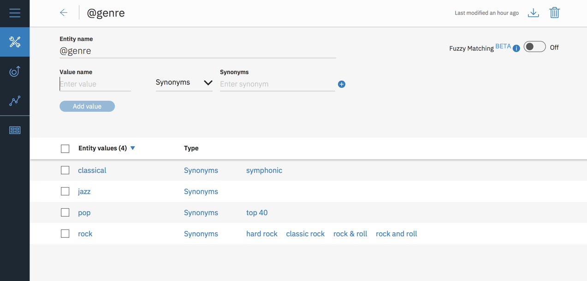

You defined two entities: `@appliance` (representing an appliance the bot can turn on) and `@genre` (representing a genre of music the user can choose to listen to).

When the user's input is received, the Conversation service identifies both the intents and entities. You can now define a dialog that uses intents and entities to choose the correct response.

## Step 7: Create a more complex dialog

In this complex dialog, you will create dialog branches that handle the #turn_on intent you defined earlier.

### Add a base node for #turn_on
Create a dialog branch to respond to the #turn_on intent. Start by creating the base node:

1.  Click the More icon  on the **#hello** node, and then select **Add node below**.
1.  Start typing `#turn_on` in the condition field, and then select it from the list.
    This condition is triggered by any input that matches the #turn_on intent.
1.  Do not enter a response in this node. Click  to close the node edit view.

### Scenarios
The dialog needs to determine which appliance the user wants to turn on. To handle this, create multiple responses based on additional conditions.

There are three possible scenarios, based on the intents and entities that you defined:

- **Scenario 1**: The user wants to turn on the music, in which case the bot must ask for the genre.

- **Scenario 2**: The user wants to turn on any other valid appliance, in which case the bot echos the name of the requested appliance in a message that indicates it is being turned on.

- **Scenario 3**: The user does not specify a recognizable appliance name, in which case the bot must ask for clarification.

Add nodes that check these scenario conditions in this order so the dialog evaluates the most specific condition first.

#### Address Scenario 1

Add nodes that address scenario 1, which is that the user wants to turn on the music. In response, the bot must ask for the music genre.

##### Add a child node that checks whether the appliance type is music

1.  Click the More icon  on the **#turn_on** node, and select **Add child node**.
1.  In the condition field, enter `@appliance:radio`.
    This condition is true if the value of the @appliance entity is `radio` or one of its synonyms, as defined on the Entities tab.
1.  In the response field, enter `What kind of music would you like to hear?` and add a second response of `What type of music do you want to hear?`
1.  Set the variation to Random by clicking on the *Set to Random* link.
1.  Name the node `Music`.
1.  Click  to close the node edit view.

Your dialog for Music should look like this:

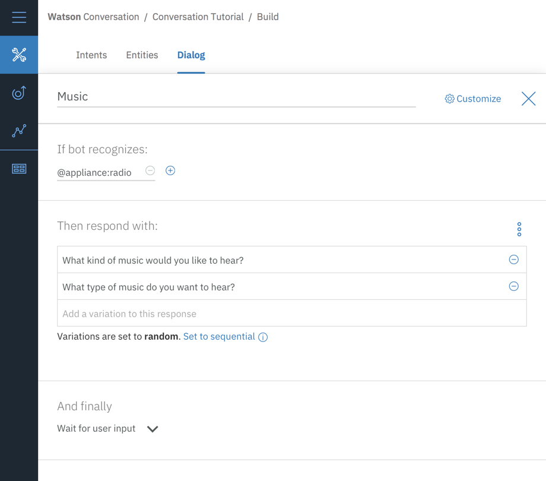

##### Add a jump from the #turn_on node to the Music node

Jump directly from the `#turn on` node to the `Music` node without asking for any more user input. To do this, you can use a **Jump to** action.

1.  Click the More icon  on the **#turn_on** node, and select **Jump to**.
1.  Select the **Music** child node, and then select **If bot recognizes (condition)** to indicate that you want to process the condition of the Music node.

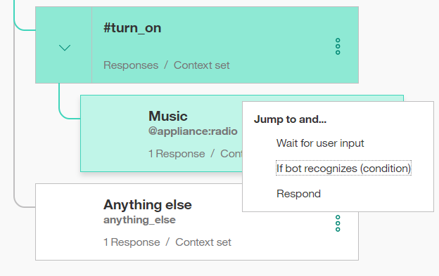

Note that you had to create the target node (the node to which you want to jump) before you added the **Jump to** action.

After you create the Jump to relationship, you see a new entry in the tree:

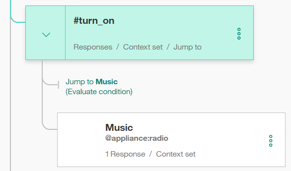

##### Add a child node that checks the music genre

Now add a node to process the type of music that the user requests.

1.  Click the More icon  on the **Music** node, and select **Add child node**.
    This child node is evaluated only after the user has responded to the question about the type of music they want to hear. Because we need a user input before this node, there is no need to use a **Jump to** action.
1.  Add `@genre` to the condition field.  This condition is true whenever a valid value for the @genre entity is detected.
1.  Enter `OK! Playing @genre.` as the response. This response reiterates the genre value that the user provides.

##### Add a node that handles unrecognized genre types in user responses

Add a node to respond when the user does not specify a recognized value for @genre.

1.  Click the More icon  on the *@genre* node, and select **Add node below** to create a peer node.
1.  Enter `true` in the condition field.
    The true condition is a special condition. It specifies that if the dialog flow reaches this node, it should always evaluate as true. (If the user specifies a valid @genre value, this node will never be reached.)
1.  Enter `I'm sorry, I don't understand. I can play classical, rhythm and blues, or rock music.` as the response.

That takes care of all the cases where the user asks to turn on the music.

##### Test the dialog for music

1.  Select the  icon to open the chat pane.
1.  Type `Play music`.
    The bot recognizes the #turn_on intent and the @appliance:music entity, and it responds by asking for a musical genre.

1.  Type a valid @genre value (for example, `rock`).
    The bot recognizes the @genre entity and responds appropriately.

    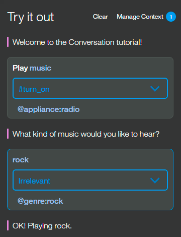

1.  Type `Play music` again, but this time specify an invalid response for the genre. The bot responds that it does not understand.

#### Address Scenario 2

We will add nodes that address scenario 2, which is that the user wants to turn on another valid appliance. In this case, the bot echos the name of the requested appliance in a message that indicates it is being turned on.

##### Add a child node that checks for any appliance

Add a node that is triggered when any other valid value for @appliance is provided by the user.
For the other values of @appliance, the bot doesn't need to ask for any more input. It just returns a positive response.

1.  Click the More icon  on the **Music** node, and then select **Add node below** to create a peer node that is evaluated after the @appliance:music condition is evaluated.
1.  Enter `@appliance` as the node condition.
    This condition is triggered if the user input includes any recognized value for the @appliance entity besides music.
1.  Enter `OK! Turning on the @appliance.` as the response.
    This response reiterates the appliance value that the user provided.

##### Test the dialog with other appliances

1.  Select the  icon to open the chat pane.
1.  Type `lights on`.

    The bot recognizes the #turn_on intent and the @appliance:headlights entity, and it responds with `OK, turning on the headlights`.

    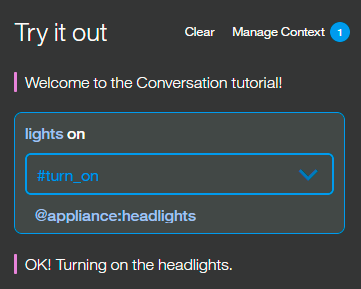

1.  Type `turn on the air`.

    The bot recognizes the #turn_on intent and the @appliance:(air conditioning) entity, and it responds with `OK, turning on the air conditioning.`

1.  Try variations on all of the supported commands based on the example utterances and entity synonyms you defined.

#### Address Scenario 3

Now add a peer node that is triggered if the user does not specify a valid appliance type.

1.  Click the More icon  on the **@appliance** node, and then select **Add node below** to create a peer node that is evaluated after the @appliance condition is evaluated.
1.  Enter `true` in the condition field.
    (If the user specifies a valid @appliance value, this node will never be reached.)
1.  Enter `I'm sorry, I'm not sure I understood you. I can turn on music, headlights, or air conditioning.` as the response.

##### Test some more

1.  Try more utterance variations to test the dialog.

    If the bot fails to recognize the correct intent, you can retrain it directly from the chat window. Select the arrow next to the incorrect intent and choose the correct one from the list.

    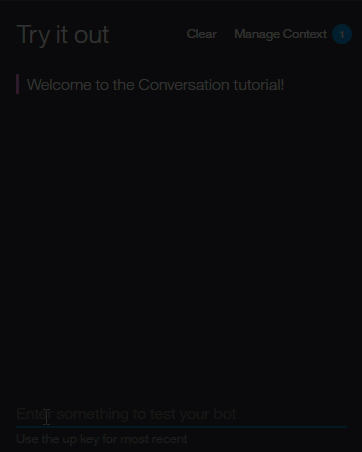

Optionally, you can review the **Car Dashboard - Sample** workspace to see this same use case fleshed out even more with a longer dialog and additional functionality.

1.  Click the **Back to workspaces** button  from the navigation menu.

1.  On the **Car Dashboard - Sample** tile, click **Edit sample**.

## Step 8: Deploy a web app to use the conversation

Now that you have built and tested your workspace, you can deploy it by connecting it to a user interface. Cick the link below.

1. 

1. Give the application a name, choose the organization and region and click deploy. 
     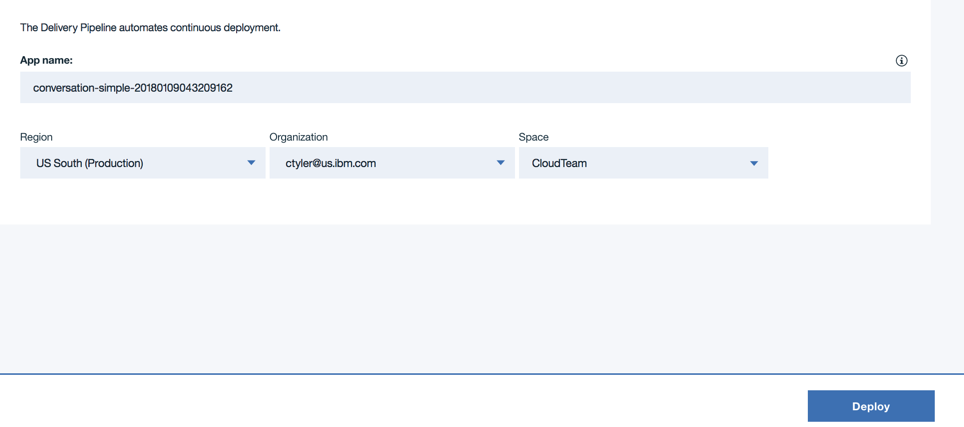

1. Click on Delivery Pipeline
     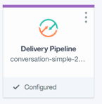
          
1. Watch the process of the Deploy Stage to see when the app is fully deployed.
    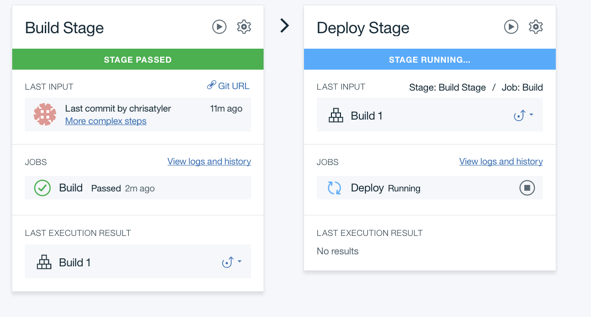
    
1. When the app is fully deployed, click on the hamburger menu for IBM Cloud and choose Cloud Foundry Apps to find the deployed app

1. Click on the line with the app you just deployed. Note: don't click on the hyperlink, just click on the line. This will take you to the application overview page. 

1. Click on the Runtime link on the left.

1. On the runtime page, click on Environment Variables in the middle of the page.
     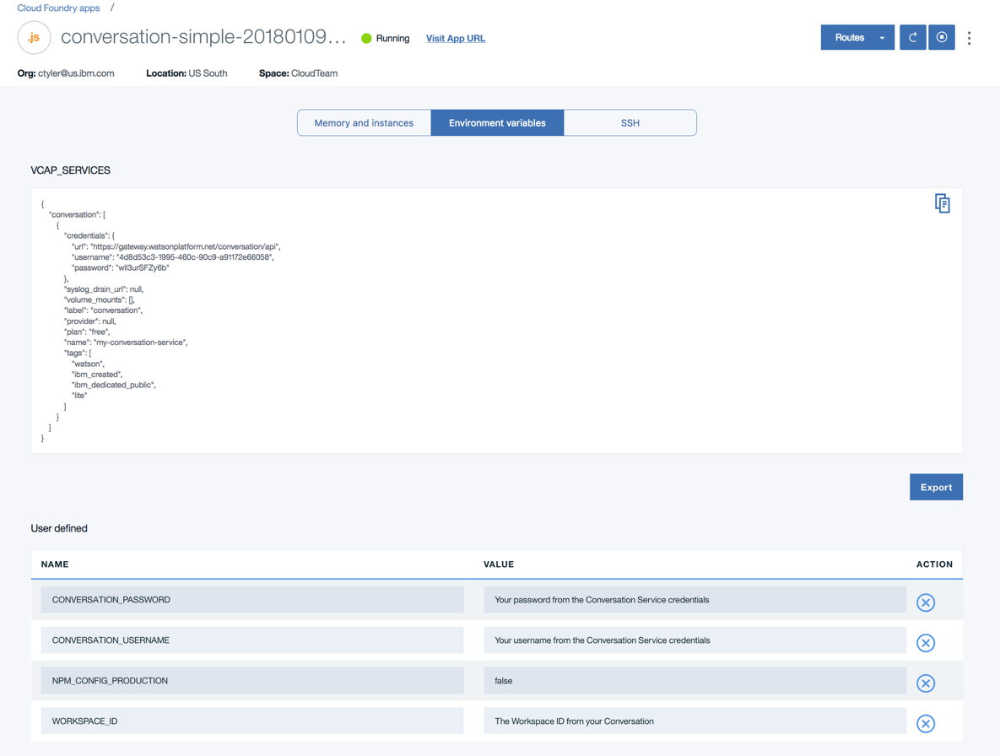
     
1. In the Environment Variables, set the CONVERSATION_USERNAME and CONVERSATION_PASSWORD values to the values from the Credentials on the Conversation Service. To get these, do the following:
      - Click on the IBM Cloud hamburger menu in the top left and choose Watson
      - Click on the Conversation service you created earlier
      - Click on the Service Credentials link on the left
      - Under the Service Credentials Actions, choose to view credentials
      - You will see the username and password in the json document
      
1. Set the WORKSPACE_ID to the workspace id in the Conversation tool. To get this, do the following:
      - Click on the IBM Cloud hamburger menu in the top left and choose Watson
      - Click on the Conversation service you created earlier
      - Click on the Launch Tool button
      - If needed, log in with your IBM ID
      - Click on the More icon  and choose View Details
      - You can copy the Workspace ID and paste it into the WORKSPACE_ID field
      
1. Click Save which will force a re-deploy of the application. One the application is re-started, you can click on the `Visit App URL` link at the top. This will take you to the sample chatbot client.
     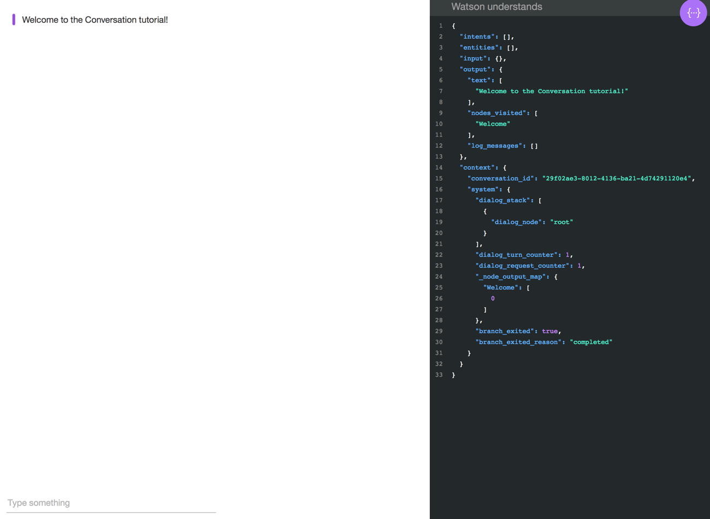
 